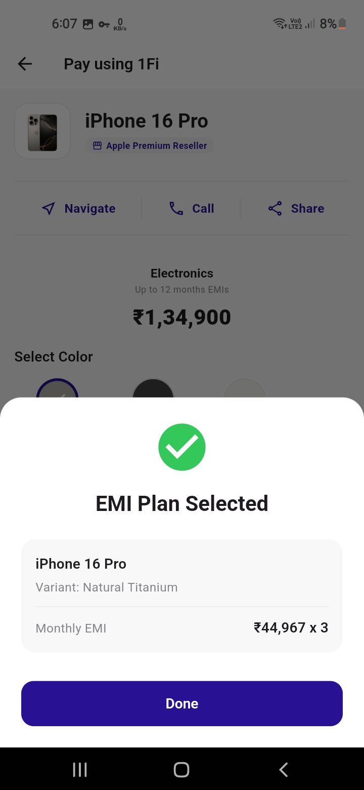
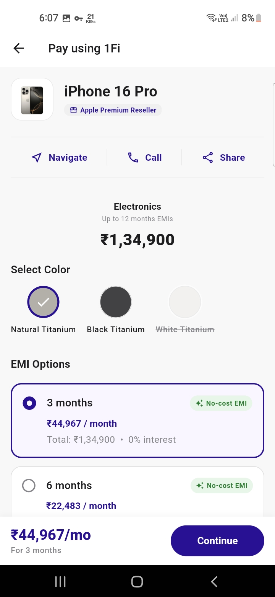
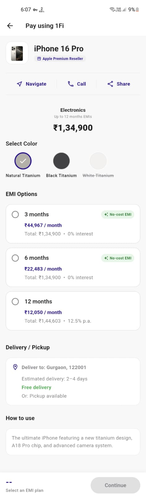
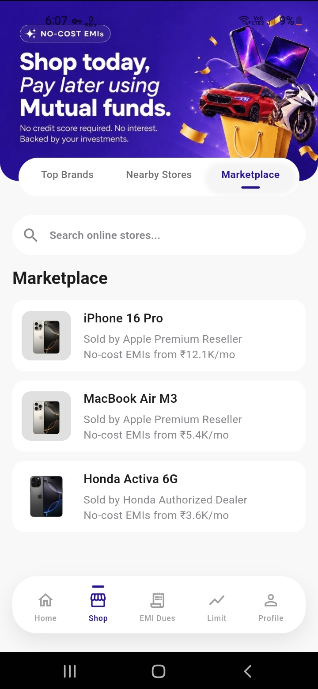

# 1Fi Marketplace Assignment

A pixel-faithful implementation of the 1Fi Marketplace feature inside the existing Shop experience, built with Flutter.

## Screenshots

  
  
  
  

## Architecture

This project uses a feature-first architecture (eatures/shop, eatures/marketplace) with a shared core/ design system to maximize component reusability. 

State management is handled cleanly by **Riverpod**, separating the UI from the mock API data layer.

## Design Decisions

1. **Tab Switcher Fidelity**: The original pill tab switcher was meticulously restyled to match the clean white and faint purple styling with active-state underlines, exactly like the reference screens.
2. **Search functionality**: Search filtering happens entirely locally and synchronously via Riverpod, avoiding "jumping" UI states and providing instant results to the user.
3. **Mock Data & Real Images**: Instead of random data, the mock product catalog matches exactly the products advertised in the hero banner (iPhone, MacBook, Honda Activa). The app intelligently uses high-quality local assets (like .webp and .jpg) and dynamically swaps product hero images based on variant color selection!
4. **Resilient UI**: The app handles missing images gracefully with a beautiful purple letter-fallback container, ensuring the UI never looks "broken".
5. **Repository Pattern**: The MockMarketplaceApi implements an abstract MarketplaceApi interface and is injected via Riverpod. This means you can swap the mock API for your real production API without touching the UI code.
6. **Delivery and Custom Dynamic EMI**: Built the exact transactional journey from product selection through variant picking, viewing the bottom dynamic EMI summary bar, to delivery/pickup details.

## Execution

The app supports all states out-of-the-box:
- **Loading**: AppSkeleton providing an exact shimmer layout.
- **Data**: Searchable product grid and comprehensive details page.
- **Empty**: Graceful empty state illustration when search yields no results.
- **Error**: Provable error state with a functioning Retry button (you can toggle shouldFail = true in mock_marketplace_api.dart to test this).

## How to Run

1. Make sure Flutter SDK is installed.
2. Run lutter pub get
3. Run lutter run for Android/iOS, or lutter run -d web-server --web-port 8080 to run seamlessly in the browser.
